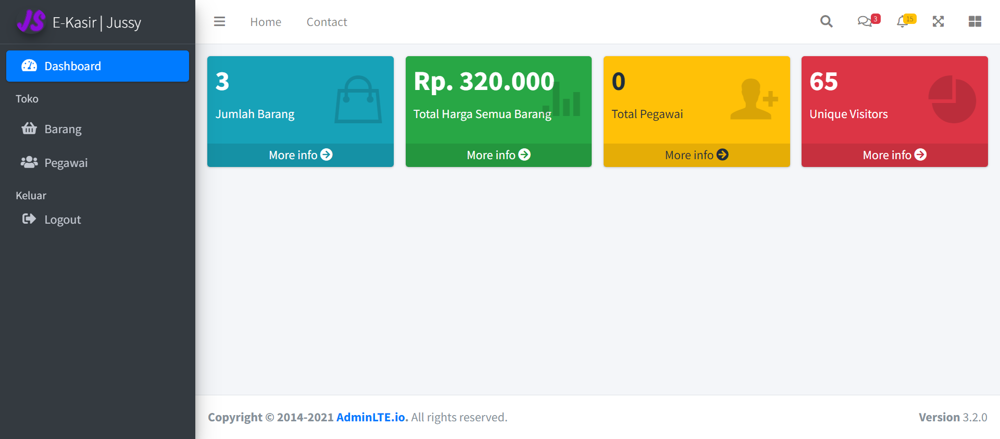

## Tech Stack

**Client:** [ruangAdminLTE](https://github.com/indrijunanda/RuangAdmin), Bootstrap, Jquery, filePond

**Server:** PHP 8.1.x, Laravel 10.x


## Dependencies

- [Laravel Breeze](https://github.com/laravel/breeze)
- [Laravel Sanctum](https://laravel.com/docs/10.x/sanctum#main-content)
- [Guzzle](https://github.com/guzzle/guzzle)


## Features

- AdminLTE template
- Authentication with Laravel Breeze
- User & Roles management (two access rights [admin, client])
- SweetAlert installed


## Installation 

You can fork or clone this project

``` 
git clone https://github.com/abdulfalaq5/pintar-FSD.git
cd pintar-FSD
composer install
cp .env.example .env <-- edit db config
php artisan key:generate
php artisan migrate:fresh --seed
```
That's it!

## Konfigurasi Midtrans Payment Gateway

Lakukan hal dibawah ini agar bisa menggunakan metode pembayaran saat checkout/bayar

```
Silahkan login ke [Midtrans]( https://midtrans.com) dan ubah Environment ke Sandbox
Pergi ke pengaturan kemudia access Keys
Buat di file .env seperti dibawah ini !!!
MIDTRANS_MERCHANT_ID=[isi dengan ID Merchant]
MIDTRANS_CLIENT_KEY=[isi dengan Client Key]
MIDTRANS_SERVER_KEY=[isi dengan Server Key]


Jalankan Server ngrok/nginx/hosting (webhook / callback payment gateway harus publis)
Salin link / domain dari server yg digunakan
Paste link tersebut di [Sandbox Midtrans](https://dashboard.sandbox.midtrans.com/settings/vtweb_configuration)
Klik update.
```
hubungi pembuat jika mengalami masalah saat penginstalan dan konfigurasi [Jussy](https://www.instagram.com/jussy_ez)

## Admin credentials
- **Email:** jussy@gmail.com
- **Password:** jussy0206


## Output Dashboard

